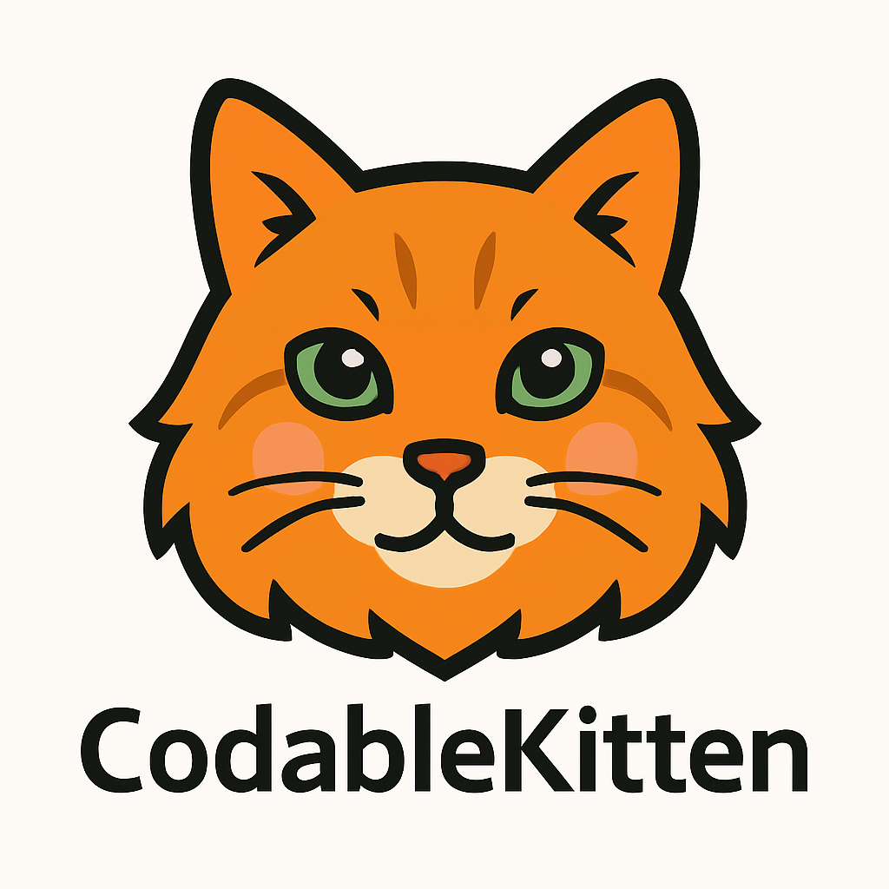

CodableKitten is a collection of tools to deal with Swift Codable objects, especially in advanced scenarios involving modularization.

## Key Features

- **ExtensibleIdentifier**: a safe, non-failing alternative to classic enums that can be extended outside the original declaration (and declaring module)
- **Polymorph**: a property wrapper powered way to decode objects into a protocol type when the concrete type is not known in advance.

## Installation

### Swift Package Manager (SPM)

You can add CodableKitten to your project using [Swift Package Manager](https://swift.org/package-manager/).

#### Xcode
1. Open your project in Xcode.
2. Go to **File > Add Packages...**
3. Enter the package repository URL:
   ```
   https://github.com/stefanomondino/CodableKitten
   ```
4. Select the version you want to install and add the package to your target.

#### Package.swift
Add CodableKitten as a dependency in your `Package.swift`:

```swift
dependencies: [
    .package(url: "https://github.com/stefanomondino/CodableKitten", from: "1.0.0")
]
```
Then add `CodableKitten` to your target dependencies:
```swift
targets: [
    .target(
        name: "YourTargetName",
        dependencies: [
            "CodableKitten"
        ]
    )
]
```

## Roadmap
- Write appropriate documentation
- Write some clear example other than the ones in unit tests
- Improve/add method documentation in code
- Add more tests

## About the name
Choosing the name of a public library is always complex because you need to find something that is easy to remember, possibly short, meaningful and on top of that you need to avoid collisions with internal framework names that might not be visible or known in advance.

I would have loved to call this "CodableKit", but "Kit" is overused by Apple and I wanted to stay away from their names.

[SourceKitten](https://github.com/jpsim/SourceKitten) already went down the cat road and I really liked their move; on top of that, I wanted to tribute something to my late ginger cat Micia (italian for "Kitty"). Felt like the right thing to do :) 
AI helped with a cartoon version of one of her pictures that became this library logo <3